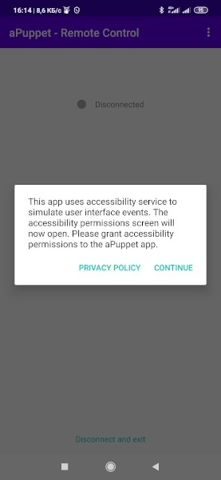
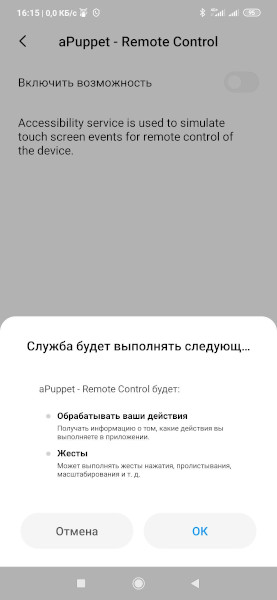
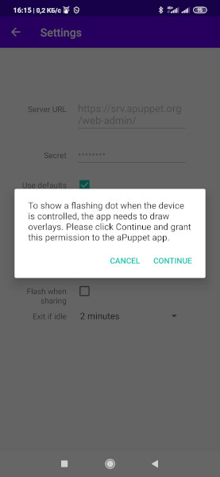
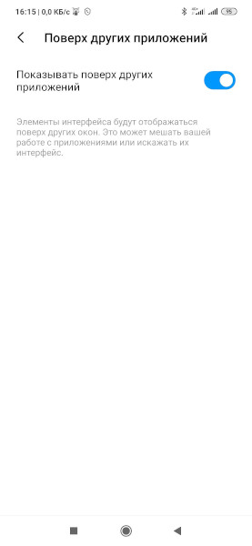
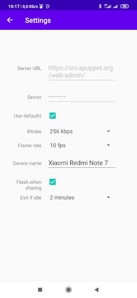
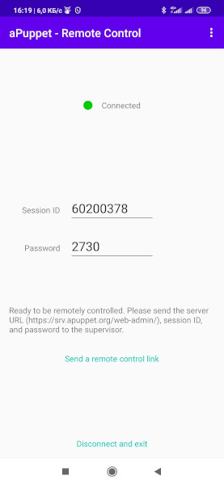
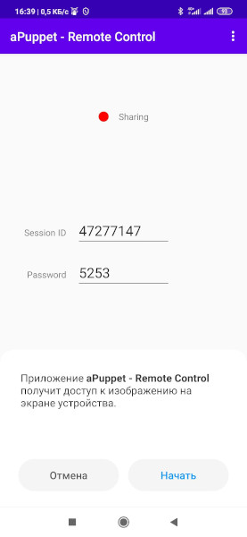
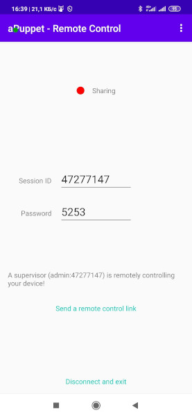

# aPuppet - the open source remote control software for Android

## Summary

aPuppet is the open source engine providing remote access to Android-based devices for the purpose of technical support and maintenance. Devices are controlled from a web-based application.

The software consists of:

- [Janus](https://janus.conf.meetecho.com/). Media server for screen sharing and gesture delivery
- [nginx](https://nginx.org/). Web server for hosting the web application
- [certbot](https://certbot.eff.org/). Agent managing SSL certificates issued by [LetsEncrypt](https://letsencrypt.org/)
- web-admin. Web application for the remote control of mobile devices

This project is the server module. The source code of the mobile agent is available at https://github.com/h-mdm/apuppet-android and also on [Google Play](https://play.google.com/store/apps/details?id=com.hmdm.control).

### Platform requirements

It is recommended to use a cloud instance or a dedicated server for the aPuppet hosting, so the software or port conflicts are avoided.

Minimal software requirements:

- 1xCPU
- 2GB RAM
- 5GB HDD

Other requirements:

- CPU architecture `x84_64` / `amd64`
- Linux, available options are:
    - Ubuntu Focal `20.04 LTS`
	- Ubuntu Bionic `18.04 LTS` 
	- Ubuntu Xenial `16.04 LTS`
    - CentOS 8
- `bash` command interpreter

The software has been tested on the DigitalOcean hosting (minimal $5 Droplet). The following Linux versions have been tested:

- Ubuntu Focal 20.04 LTS x64
- Ubuntu Bionic 18.04.3 LTS x64
- Ubuntu Xenial 16.04.6 LTS x64
- CentOS 8 x64

The web application for remote control (web-admin) has been tested and found to be fully functional in the following browsers:
- Chrome 86+
- Firefox 83+
- Opera 72+
- Safari 11+
- Edge 79+

## Deployment

### Platform setup

Update the system installation packages:

    sudo apt update

Install git in case it's not installed yet:

    sudo apt install -y git

### aPuppet setup

#### Get the source code

Download the source code to the server via `git` from the repository https://github.com/h-mdm/apuppet-server.

    git clone https://github.com/h-mdm/apuppet-server.git

Notice: to get the source code of the premium version, contact the sales at https://apuppet.org.

#### Before the installation

Change the directory to the project directory:

    cd apuppet-server

Edit the file `config.yaml` and setup the domain name where aPuppet will be installed and the administrator's email: 

    ---
    hostname: "apuppet.my-company.org"
    email: "administrator@my-company.org"

_Important: aPuppet is designed to work on the dedicated domain. You can use either a domain like `yourdomain.com` or a subdomain of any level. During the installation, the software checks the existence of the domain name entered in `config.yaml` and verifies its ownership (otherwise the setup is aborted). Therefore, you need to create and setup a (sub)domain so it is resolved to an external IP address of your server._

#### Installation

    sudo ./install.sh

After the successful run of this command, aPuppet will be configured, installed and started.

You can open the remote control web app (web-admin) using the URL `apuppet.my-company.org/web-admin/`

## Usage

To control the mobile device remotely, you need to install the  [aPuppet](https://play.google.com/store/apps/details?id=com.hmdm.control) application available on Google Play.

Notice: you can also get the mobile app source code at [github](https://github.com/h-mdm/apuppet-android) and build your own version.

At first start, grant the required permissions.

- to simulate the user's gestures:

- to draw over other apps (so the mobile app could display a sharing indicator):

The app on Google play points to the public aPuppet server (srv.apuppet.org) by default. You can change the server URL and secret in the app settings:

If you build the mobile app from the source code, you can change the default server URL and secret to your own values in `build.gradle`.

On the main screen of the application, you can see the server connection status and the remote access credentials: `Session ID` and `Password`:

Enter these credentials in the `web-admin` application or just open the link provided by the mobile app. The mobile device will ask for the screen sharing permission. Grant this permission to start a remote support session:

## Custom SSL certificate

To setup the HTTPS connection, aPuppet uses free certificates provided by LetsEncrypt. These certificates are supported by most OS and browsers.

Note that LetsEncrypt certifies only the domain name ownership and authenticity. It doesn't certify the data about your company. This fact may make LetsEncrypt not appropriate for work with sensitive data, for example in financial or medical areas.

In the Premium version, you can use any HTTPS certificate. Please fill in the contact form at https://apuppet.org for details and how to purchase a premium license.

## Updates

In most cases, aPuppet can be updated by renewing the source codes and running `./install.sh`.

    cd apuppet-server
    git pull
    sudo ./install.sh

This will update aPuppet to the latest version.

## Operation details

### Installation

Here's what the script `install.sh` does:

- checks the OS type and version. The aPuppet setup is aborted if the OS differs from Ubuntu LTS version 16.04, 18.04, 20.04.
- installs the required version of *Ansible*
- executes the Ansible playbook deploy/install.sh which installs aPuppet and required dependencies
- executes the Ansible playbook deploy/start.sh which configures and starts aPuppet

The script should be started with root privileged or via sudo:

    sudo ./install.sh

**Any changes in aPuppet configuration, templates or web-admin source code should be followed by running the install.sh script to reconfigure aPuppet, apply all changes and restart the service!**

#### About Ansible

To run `playbooks`, Ansible 2.9.x must be installed.

Ubuntu Focal (20.04 LTS) already has the required version in the repository. Older Ubuntu releases include a deprecated version of Ansible, so the required version is installed from the [official PPA](https://launchpad.net/~ansible/+archive/ubuntu/ansible).

You can read more about the Ansible setup in the [official Ansible documentation](https://docs.ansible.com/ansible/2.9/installation_guide/intro_installation.html).

_In the future, official PPA may change the latest version to 2.10.x or above. Since there is a substantial difference between version 2.10 and the required version 2.9.x, the installation may fail. If you will get any issues with the Ansible version, please contact the aPuppet development team at https://apuppet.org._

#### Installed software

To deploy the system and run Ansible playbook, the following software is installed:

- System packages: `git`, `apt-transport-https`, `ca-certificates`, `curl`, `gnupg-agent`, `software-properties-common`, `python-pip`, `python3`, `python3-setuptools`, `python3-pip`
- Python 2 components: `dnspython`
- Python 3 components: `docker`, `docker-compose`, `dnspython` 

### aPuppet configuration

aPuppet includes several configuration files:

- `config.yaml`. This is the primary aPuppet configuration. All changes must be done here.
- `deploy/config.build.yaml`. This is the aPuppet build and deployment configuration. We don't recommend to change anything here because it may break the software compilation.
- `deploy/config.defaults.yaml`. This is the default aPuppet configuration.

Here's the list of available configuration parameters and their default values:
- `hostname`. The domain used to accept remote control connections from mobile devices
- `email`. Administrator's email used to generate a LetsEncrypt certificate and get notifications from [LetsEncrypt](https://letsencrypt.org/)
- `nat`. If aPuppet is installed behind NAT you should set this flag: `nat: true`
- `public_ip`. Public IP is used if aPuppet is behind NAT. By default, it is determined by resolving your hostname via DNS, and can be overridden in config.yaml
- Janus
    - `api_http: true`. Allows REST API over the non-encrypted HTTP protocol. Since Nginx proxy uses HTTP, it is recommended to set it to true
    - `api_http_port: 8088`. HTTP port for REST API 
    - `api_https: true`. Allows REST API on encrypted HTTPS protocol
    - `api_https_port: 8089`. HTTPS port for REST API 
    - `admin_api_https: false`. Enables Admin REST API over the HTTPS protocol. Since the admin API is not used, it is not recommended to turn on this setting.
    - `admin_api_https_port: 7889`. HTTPS port for Admin REST API
    - `api_wss: true`. Enables Websockets API over HTTPS (WSS). This is a recommended and most effective method of interaction between the server and the web admin application
    - `api_wss_port: 8989`. HTTPS port for Websockets API
- Nginx
    - `is_nginx_enabled: true`. Enables nginx. If nginx is disabled, you need to place the `web-admin` module (`deploy/dist/web-admin/` folder) on your web server
    - `web_http_port: 80`. HTTP port
    - `web_https_port: 443`. HTTPS port
- RTP
    - `rtp_port_range: 10000-10500`. Range of UDP ports used for casting the mobile device screen
- SSL and Certbot
    - `is_certbot_enabled: true`. Enables Certbot. If you're not using a custom SSL certificate, it is recommended to enable Certbot, otherwise the connection will not be encrypted
    - `share_email: true`. Provides your email to [EFF](https://www.eff.org/) (Electronic Frontier Foundation), the Certbot developer company

### Firewall configuration

aPuppet uses the following incoming ports which should be allowed on your firewall or forwarded via NAT:

- **80/TCP** - used only by certbot to renew certificates
- **443/TCP** - used by nginx to display the web UI
- **8989/TCP** - WSS protocol used by WebRTC to play the video
- **8089/TCP** - used by the web application to communicate with Janus server (REST API)
- ** */UDP** - UDP ports are used for the RTP screencast (the port is chosen dynamically by Janus).

*Notice: aPuppet requires enabling all incoming and outgoing UDP traffic, especially if you're behind a NAT.*

### Setup options and use cases

You can install aPuppet with different options.

#### Janus, Nginx, Certbot

Installation of all components, generation and renewal an SSL certificate required for aPuppet proper work.

This is the default option. Set the parameters `is_certbot_enabled` and `is_nginx_enabled` (or comment them) in the main configuration file `config.yaml`.

#### Janus, Nginx

If you have your own SSL certificate, you can use it in aPuppet premium (contact the sales team on https://apuppet.org for details).

To setup this option, turn off certbot in the configuration file `config.yaml`:

    is_certbot_enabled: false

#### Janus only

In this option, only media server is installed. This option can be used if you already have a website where the aPuppet web application should be embedded.

To implement this option, turn off certbot and nginx in `config.yaml`:

    is_certbot_enabled: false
    is_nginx_enabled: false

### Operation

Before executing commands, change the directory to the one where aPuppet is installed:

    cd ~/apuppet-server

The system is based on `docker-compose`, therefore you need to use docker-compose commands to start, restart, stop, and other aPuppet management actions.

View the running services and their states:

    docker-compose ps

Start services (a recommended method):

    docker-compose up --detach

You can also start the software in a foreground mode (in the console). In this mode, the software can be stopped by pressing `Ctrl+C`. We __DO NOT recommend__ this mode on a production server.

    docker-compose up

Restart services:

    docker-compose restart

Stop:

    docker-compose stop

Stop and removal all containsers, networks images:

    docker-compose down

More information about docker-compose commands and their parameters can be found in the [official docker-compose documentation](https://docs.docker.com/compose/reference/overview/).

### Secret codes

To disable unauthorized access to your server, two secret codes are generated during the installation:

- `janus_api_secret`. This is a secret code to call API methods by a mobile application. This secret is stored in `./dist/credentials/janus_api_secret`
- `janus_admin_api_secret`. A secret code to call Admin API methods. This secret is stored in `./dist/credentials/janus_admin_api_secret`

`janus_api_secret` is required for both the web and mobile applications. It is automatically saved in the web application configuration and is displayed on the screen when aPuppet is started. 

You need to enter this API secret together with the server URL in the configuration of a mobile application. If you build your own version of the mobile app, you can change the default values in `build.gradle`.

### Logs

#### Log setup
The aPuppet logs are written by using a standard docker logging.

Default setup:
- driver: `json-file`
- compression: on
- rotation parameters:
    - maximum file size: 20 Mb
    - amount of files: 5

Logs are stored in the docker's system folders, the path to logs is `/var/lib/docker/containers/<container_id>/`.

A fine tuning of logging through Ansible's yaml files is not implemented. If you need to change the default logging setup, you can do it in the docker-compose.yaml configuration file: `./dist/templates/docker-compose/docker-compose.yaml.j2`. Each service uses a logging section with its own logging parameters.

_Read more about docker logging in the [official docker logging documentation](https://docs.docker.com/config/containers/logging/configure/)_.

#### View logs

To view aPuppet logs, use standard docker-compose commands.

View all logs:

    docker-compose logs

View logs of certain services:

    docker-compose logs janus
    docker-compose logs nginx certbot

You can limit the output to last N lines by the `--tail` parameter:

    docker-compose logs --tail=100

To follow log messages in realtime, use the parameter `--follow` or `-f`:

    docker-compose logs --tail=100 --follow

You can combine multiple parameters if required:

    docker-compose logs --tail 100 --follow certbot
    docker-compose logs --tail=100 -f janus nginx

_Read more about logging in [docker](https://docs.docker.com/engine/reference/commandline/logs/) and [docker-compose](https://docs.docker.com/compose/reference/logs/)._

### web-admin

This is a web application for the remote access to the mobile device through a web browser. The app is written in HTML, CSS, and Javascript (WebRTC library is used for displaying the screencast and transferring gestures to a mobile device).

The source code of the web application is stored in the folder `web-admin/`. During the deployment, it is compiled by using gulp: CSS and JS are minified and concatenated. The production files are stored in the folder `deploy/dist/web-admin`. In the same folder, a configuration file `settings.js` is stored, which contains the aPuppet settings (paths, ports, secrets).

If you need to modify the source code of the web admin application, modify the `web-admin` folder and run the following command to apply your changes:

    ansible-playbook deploy/pre_webadmin.yaml

Notice: `./install.sh` will also apply changes but it is executed much slower.

